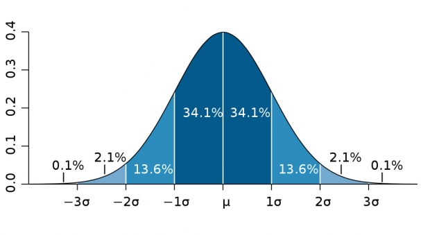

# Fine Tuning Basics

## Dataset

The relationship between the number of records and quality is logarithmic, not linear. When number of records for training dataset crosses certain threshold (often around 10k–20k for specific tasks), the quality of the model begins to plateau.

Quality of data matter more than Quantity. High-Quality 10K perfectly curated, diverse records will outperform 100K mediocre ones.

## Tokenizer

Tokenizer is critical for fine tuning as standard tokenizers often break Dataset-specific keywords into weird sub-words. For example, Suricata keywords `pcre` → ["p", "cre"] or ["pc", "re"] and `classtype` → ["class", "type"]. By adding custom tokens e.g. `sid`, `rev`, `pcre`, and `msg` as atomic tokens to Model's tokenizer we ensure the model treats them as single mathematical entities.

CodeBERT’s RoBERTa-based tokenizer uses Byte-Pair Encoding (BPE). When new tokens are added to a pre-trained model like CodeBERT, their initial embeddings are random. We have to train long enough (more then 3 Epochs) for the model to "learn" these new vectors and integrate their meanings.
Custom tokens are highly effective for Qwen Code model (the one converting invalid to valid). When Qwen needs to "fix" a rule, having atomic tokens prevents "hallucinating" misspelled keywords (e.g., `classtipe`). Because Suricata rules are long, turning 3-token keywords into 1-token keywords allows the model to "see" more rules within its 512-token limit.

`FastLanguageModel.from_pretrained` is a helper method from the Unsloth library used to efficiently load large language models for fast inference and fine-tuning (especially LoRA/QLoRA) on limited GPUs like a T4. Below are its parameters.

- `model_name`:Specifies the name of the pre-trained model to load.
- `dtype`:Specifies the data type for model weights and computations. None: Automatically selects the appropriate [data type](https://github.com/pytorch/pytorch/blob/main/torch/utils/_dtype_abbrs.py) based on the hardware. `torch.float16` Uses 16-bit floating point precision, reducing memory usage and potentially increasing speed on compatible GPUs. `torch.bfloat16` is similar to float16 but with a wider dynamic range, beneficial for certain hardware like NVIDIA A100 GPUs. Every model on Hugging Face has a [config.json](https://huggingface.co/Qwen/Qwen2.5-Coder-3B-Instruct/blob/main/config.json) file which has [**torch_dtype**](https://moocaholic.medium.com/fp64-fp32-fp16-bfloat16-tf32-and-other-members-of-the-zoo-a1ca7897d407) which determines the model's precision.

- `load_in_4bit`:Determines whether to load the model using 4-bit quantization. Ideal for scenarios where memory efficiency is crucial, such as deploying models on edge devices or during experimentation. When set to false, then model will attempt to load in its native 32-bit (FP32) or 16-bit (FP16/BF16).

  Determine the memory footprint of a model as below:
    - Parameter Count: The number followed "B" e.g. "3B" in the name stands for ~3 Billion parameters.
    - Precision (Dtype):
        - Full Precision (FP32): 4 bytes per parameter.
        - Half Precision (FP16:Float16 / BF16:Bfloat16): 2 bytes per parameter.
        - 4-bit Quantization (bitsandbytes/Unsloth): 0.5 bytes per parameter.

$$\text{Model Weight Size} = \text{Parameters} \times \text{Bytes per Parameter}$$

- `max_seq_length`:Defines the maximum sequence length (in tokens) that the model can process. max_seq_length = 2048 allows the model to process sequences up to 2048 tokens long. The maximum number of tokens the model can process in a single forward pass. 

  - For English-like text, 1 token ≈ 3–4 characters (average).
  - For code / structured text (like Suricata rules), 1 token ≈ 2–3 characters (often smaller).


```python
model, tokenizer = FastLanguageModel.from_pretrained(
    model_name = "unsloth/llama-3-8b-bnb-4bit",
    max_seq_length = 2048,
    dtype = None,            # Auto detection
    load_in_4bit = True,     # Essential for T4 GPU
)
```

## LoRA adapters (PEFT)

**The LoRA Forward Pass Formula**
$$y = \left( W_0 + \frac{\alpha}{r} BA \right) x$$

|Symbol|Definition|Role|
|---|---|---|
|W0​|Original Weight Matrix|Frozen: Pre-trained weights that are not updated|
|A|Low-rank Matrix A|Trainable: Usually initialized with Gaussian noise|
|B|Low-rank Matrix B|Trainable: Usually initialized to zero|
|r|Rank|The Decomposition Rank (e.g., r=8)|
|α|Alpha|The Scaling Factor for the adapter's influence|
|x|Input Vector|The hidden state passed into the layer|

LoRA configuration is quite small ($r=16$) and likely only targeting a few attention layers (usually just query and value). This means the adapter might not have enough capacity to memorize specific keyword exceptions like `modbus` protocol.


### Rank (r) HyperParameter

| Model Size | Common Values | Notes |
|---|---|---|
| < 1B Params  | 4, 8, 16 | Low rank works well, avoid overfitting |
| 1B-7B | 8, 16, 32 | Balances expressiveness and efficiency |
| > 13B | 8, 16, 32 | Higher rank may help capture nuances |
| 65B+ | 64, 128 | Very large models benefit from higher rank |


| LoRA Rank ($r$) | Classification | Impact on Accuracy & Behavior |
| --- | --- | --- |
| **1 – 4** | **Minimalist** | **Low Accuracy for Content.** High accuracy for *style*. The model learns to change its "tone" (e.g., becoming more polite) but lacks the "room" to learn complex new technical logic or multi-step rules. |
| **8 – 16** | **The Standard** | **Syntax & Logic.** This is where most domain-specific fine-tuning lives. It allows the model to learn new "grammars" (like keywords) without forgetting how to code in general. It strikes the best balance for 3B model. |
| **32 – 64** | **High Capacity** | **Knowledge Injection.** Necessary for "Knowledge Intensive" tasks. If you are teaching the model thousands of specific mappings it has never seen before, $r=64$ provides the "room" to store those new relationships. |
| **128+** | **Full-SFT Proxy** | **Diminishing Returns.** At this level, LoRA begins to behave like "Full Fine-Tuning." It can solve very hard reasoning tasks (GSM8K/Math), but the risk of **Catastrophic Forgetting** (the model loses its general abilities) increases significantly. |

Research shows that for most tasks, increasing rank beyond 32 provides negligible accuracy gains but significantly increases VRAM usage and training time.


### Quantization

The process of converting high-precision numbers (like float32) into lower-precision formats (like int8) to reduce memory and computation in machine learning models ia called Quantization. This process will cause to lose some accuracy but based on the usecase the accuracy could be good enough.

The quantization scale is defined as below, were x is original values (float32), while q is quantized value (int8)

$$Scale = \frac{x_{max} - x_{min}}{q_{max} - q_{min}}$$

Formula to get Quantized values using Scale (Mapping values into limited range of integers):

$$q = \text{round} \left( \frac{x - \text{zero point}}{Scale} \right)$$

 **Normal Float Quantization (NF4)**: A 4-bit data type designed specifically to store neural network weights for Large Language Models providing higher precision than standard 4-bit formats (like INT4 or FP4).



 **QLora**: A memory-efficient fine-tuning method that combines 4-bit quantization (compressing model weights) with Low-Rank Adaptation (LoRA) (training small adapter matrices). QLora uses **4-bit Quantization (NF4)** which matches the weight distribution, **Double Quantization** to Quantize the quantization constants and **Page Optimizers** which swaps optimizer state in/out like virtual memory.

## Activations

Activations are the intermediate mathematical outputs stored at every layer of the neural network during a forward pass, so the model can learn during the backward pass.
The GPU holds onto every intermediate tensors until the calculation to improve back propagation is finished. Activations change size based on two factors: Sequence Length and Batch Size.
The longer input sequence, the more computation has to be performed at every layer. Also if `per_device_train_batch_size` is doubled, the GPU is running dataset records through the network at the exact same time. This doubles the activation memory requirement instantly. Hence activations can cause OutOfMemory (OOM) for batch containing a very complex, long length of tokens. The control Activation Memory, use `use_gradient_checkpointing` to store all memory data. This reduces Activation memory by ~70% at the cost of being ~20% slower.


## LoraConfig Parameters

Adjusting the `LoraConfig` parameters allows you to balance model performance and computational efficiency in Low-Rank Adaptation (LoRA). Here’s a concise breakdown of key parameters:

- `r`: The rank of the low-rank matrices in LoRA; higher values can capture more information but increase memory usage. 
  - **Higher**: Retains more information, increases computational load.
  - **Lower**: Fewer parameters, more efficient training, potential performance drop if too small.

Lora rank values could be (8, 16, 32, 64, 128), and choose 16 or 32. A rank of 8 or 16 performs within 0.1% to 0.5% of a rank of 32 or 64.

- `target_modules`: The parts of the model we want to apply LoRA adapters. It is list of model components (e.g., "q_proj", "k_proj") where LoRA adapters are inserted for fine-tuning.

  - **q_proj (query projection)**: Part of the attention mechanism in transformer models, responsible for projecting the input into the query space.
    **Impact**: Transforms the input into query vectors that are used to compute attention scores.

  - **k_proj (key projection)**: Projects the input into the key space in the attention mechanism.
    **Impact**: Produces key vectors that are compared with query vectors to determine attention weights.

  - **v_proj (value projection)**: Projects the input into the value space in the attention mechanism.
    **Impact**: Produces value vectors that are weighted by the attention scores and combined to form the output.

  - **o_proj (output projection)**: Projects the output of the attention mechanism back into the original space.
    **Impact**: Transforms the combined weighted value vectors back to the input dimension, integrating attention results into the model.

  - **gate_proj (gate projection)**: Typically used in gated mechanisms within neural networks, such as gating units in gated recurrent units (GRUs) or other gating mechanisms.
    **Impact**: Controls the flow of information through the gate, allowing selective information passage based on learned weights.

  - **up_proj (up projection)**: Used for up-projection, typically increasing the dimensionality of the input.
    **Impact**: Expands the input to a higher-dimensional space, often used in feedforward layers or when transitioning between different layers with differing dimensionalities.

  - **down_proj (down projection)**: Used for down-projection, typically reducing the dimensionality of the input.
    **Impact**: Compresses the input to a lower-dimensional space, useful for reducing computational complexity and controlling the model size.

Suricata syntax is a very rigid, rule-based language; it is not as complex as natural human language. By giving the model massive parameter capacity (r=32 + dense layers), it is highly prone to memorizing the training dataset (overfitting) rather than learning the generalized rules. When it sees the slightly different 20K unseen rules in the evaluation set, its strict memorization causes it to fail.

- `lora_alpha`: Scales the strength of the fine-tuned adjustments in relation to the rank (r). It controls the impact of the adapters on the model's outputs. Recommended values are r (standard) or r * 2 (common heuristic).
  - **Higher**: Increases influence, speeds up convergence, risks instability or overfitting.
  - **Lower**: Subtler effect, may require more training steps.

- `lora_dropout`:  Probability of zeroing out elements in low-rank matrices for regularization. Dropout rate applied to LoRA layers during training to prevent overfitting. Default value is 0 (0 to 0.1).
  - **Higher**: More regularization, prevents overfitting, may slow training and degrade performance.
  - **Lower**: Less regularization, may speed up training, risks overfitting.

- `bias`: Specifies how biases are handled in LoRA layers; options include "none", "all", or "lora_only".
- `use_gradient_checkpointing`: Enables gradient checkpointing to reduce memory usage during training; "unsloth" uses Unsloth's optimized version.
- `random_state`: Seed for random number generators to ensure reproducibility of training results.

- `use_rslora`: Boolean indicating whether to use Rank-Stabilized LoRA (rsLoRA) for potentially more stable training. Enables Rank-Stabilized LoRA (RSLora).
  - **True**: Uses Rank-Stabilized LoRA, setting the adapter scaling factor to `lora_alpha/math.sqrt(r)`, which has been proven to work better as per the [Rank-Stabilized LoRA paper](https://doi.org/10.48550/arXiv.2312.03732).
  - **False**: Uses the original default scaling factor `lora_alpha/r`.

- `loftq_config`: Configuration for Low-Rank Quantization (LoftQ), , a quantization method for the backbone weights and initialization of LoRA layers. Set to None to disable this feature.
  - **Not None**: If specified, LoftQ will quantize the backbone weights and initialize the LoRA layers. It requires setting `init_lora_weights='loftq'`.
  - **None**: LoftQ quantization is not applied.
  - **Note**: Do not pass an already quantized model when using LoftQ as LoftQ handles the quantization process itself.

```python
# Define LoRA Config (Upgraded)
peft_config = LoraConfig(
    task_type=TaskType.SEQ_CLS,
    inference_mode=False,
    r=32,               # Gives the model more parameters to learn edge cases
    lora_alpha=64,      # Scales the learned weights stronger
    # explicitly target all attention and dense layers in RoBERTa/CodeBERT
    target_modules=["query", "key", "value", "dense"], 
    lora_dropout=0.1
)
```

The `get_peft_model` from unsloth's `FastLanguageModel` class to attach adapters (peft layers) on top of the models in order to perform QLoRA.

```python
model = FastLanguageModel.get_peft_model(
    model,
    r = 16, # Rank: higher = more "memory" but more VRAM usage
    target_modules = ["q_proj", "k_proj", "v_proj", "o_proj",
                      "gate_proj", "up_proj", "down_proj",],
    lora_alpha = 16,
    lora_dropout = 0, 
    bias = "none",    
    use_gradient_checkpointing = "unsloth",
    random_state = 3407,
)
```

## Trainer Configuration

- `model`: Name of the model from HuggingFace. 
- `tokenizer`: Tokenizer object that will be trained.
- `train_dataset`: The dataset used for training.
- `dataset_text_field`: Specifies the field in the dataset that contains the text data.
- `max_seq_length`: Maximum sequence length for the input data. GPUs perform matrix multiplications using Tensor Cores, which are most efficient when dimensions are multiples of 8, 16, or ideally powers of 2.
- `dataset_num_proc`: The number of CPU worker processes used to tokenize and preprocess the dataset for data loading. It only affects the startup time i.e. the pre-tokenization phase
  - One: One CPU core handles the entire dataset records sequentially.
  - Two or Four: The dataset is split into chunks, and multiple CPU cores work in parallel to tokenize them.
- `packing`: If True, enables sequence packing (concatenates multiple examples into a single sequence to better utilize tokens).
  - **Standard SFT (No Packing):** If a record is 100 tokens and the `max_seq_length` is 512, the GPU processes 100 tokens and "wastes" the other 412 as padding. We still use 1 slot of the batch.
  - **Packed SFT:** The trainer concatenates all the records into one giant stream of tokens and chops them into exactly 512-token blocks.

 - `dataloader_num_workers`: DataLoader is responsible for grabbing the next batch of dataset records from the hard drive/RAM and pushing them into the GPU VRAM. The CPU spawns separate sub-processes that stay ahead of the GPU. They prepare the next few batches in advance so that as soon as the GPU finishes one calculation, the next batch is already sitting in VRAM ready to go.
 - `pin_memory`: Recommended to be enabled when using workers to speed up CPU-to-GPU transfer.

## Training Arguments

### Throughput and Batching

- `per_device_train_batch_size`: Number of samples per batch for each device. Number of rows of data the GPU sees at once.

- `gradient_accumulation_steps`: Number of steps to accumulate gradients before performing a backpropagation update and updating model weights. Default value is 1. 
Instead of updating the model after every small batch (which requires high VRAM for activations), we calculate gradients over several mini-batches and sum them up before performing a single update. This lets us simulate a large batch size on a small GPU.
Since the T4 has limited VRAM (16GB), we cannot use a huge batch size. This parameter tells the model to "wait" and add up gradients for steps before actually updating the weights.
  - **Higher**: Accumulate gradients over multiple steps, effectively increasing the batch size without requiring additional memory. This can improve training stability and convergence, especially with large models and limited hardware.
  - **Lower**: Faster updates but may require more memory per step and can be less stable.

  $$\text{Effective Batch Size} = \text{Per Device Train Batch Size} \times \text{Gradient Accumulation Steps}$$

  GPUs are designed for parallel processing. The GPU processes `per_device_train_batch_size` number of samples in parallel, calculates gradients for each of them, and saves them. It repeats this for `gradient_accumulation_steps` number of times. Hence higher `per_device_train_batch_size` means more faster processing, but also higher VRAM usage. The `gradient_accumulation_steps` has almost zero impact on VRAM. It only stores a single extra set of gradients, which is a fixed size regardless of whether we accumulate for 10 steps or 1000 steps.

  Start with `gradient_accumulation_steps = 1`, increasing it as (1, 2, 4, 8...) until we get an OutOfMemory (OOM) error.

- `optim`: Optimizer type, here using an 8-bit version of AdamW. The `adamw_8bit` value sets optimizer to use 8-bit precision for the optimizer states, saving roughly 75% of the VRAM usually taken by the optimizer.

  Optimizers don't just store the weights, they also store moving averages (momentum and variance) for every single trainable parameter. With LoRA we only need to store the trainable adapters.

  | Optimizer Type | Extra Memory per Trainable Parameter | For a 3B Model (Full Fine-Tune) |
  | --- | --- | --- |
  | **Standard AdamW (FP32)** | 8 bytes (2 states @ 4 bytes each) | **+24 GB** (Impossible on T4) |
  | **AdamW 8-bit** | 2 bytes (2 states @ 1 byte each) | **+6 GB** |
  | **paged_adamw_8bit** | 2 bytes (Moves to CPU RAM when full) | **+6 GB** (Safest for T4) |
  | **SGD (Basic)** | 0 bytes (No states stored) | **0 GB** (But learns poorly) |


### Learning Rate Warmup

Starts the training with a very low learning rate to "warm up" the weights and prevent the model from crashing (diverging) on the first few samples.

- `warmup_steps`: A fixed number of steps (integer) for learning rate warmup. It gradually increases the learning rate at the start of training. Recommended 5-10% of total steps.
- `warmup_ratio`: A percentage of the total training which is Float value between 0 and 1.  E.g. `warmup_ratio=0.05` on a 1,000-step run means the first 50 steps are warmup. If you increase your dataset or epochs, the warmup period grows automatically. Warmup ratio is generally preferred because it scales with your data. If you use a fixed warmup_steps=500 but only run for 60 steps, you will never actually reach your full learning rate.

### Training Duration

- `num_train_epochs`: One full pass through all dataset records. Training stops after the model has seen every single row in the dataset $N$ times. If we set epochs as 2, then trainer will run for twice the steps.

$$\text{Steps per Epoch} = \frac{\text{Total Records}}{\text{Effective Batch Size}}$$

On a Google Colab T4, training 74K records with a 3B model will take a while. At roughly 1.5 to 2 seconds per step (estimate for Qwen 2.5 3B with LoRA), 4,619 steps will take about 2 to 2.5 hours.

- `max_steps`: Total number of training steps. It is a manual override and hard-stops the training after a specific number of batches, regardless of how much data is left. If it is set to any value greater than $0$, it ignores num_train_epochs. If we use max_steps = 60, it will finish in about 2 minutes, but the model will only have seen a tiny fraction of the dataset. By default its value is -1, were the trainer ignores this and follows the `num_train_epochs` instead.

$$\text{Total Training Steps} = \frac{\text{Total Records} \times \text{Epochs}}{\text{Effective Batch Size}}$$

### Learning

- `learning_rate`: Learning rate for the optimizer. The rate at which the model updates its parameters during training. Default value is 2e-4, which is the sweet spot for LoRA fine-tuning.
  - **Higher**: Faster convergence but risks overshooting optimal parameters and causing instability in training.
  - **Lower**: More stable and precise updates but may slow down convergence, requiring more training steps to achieve good performance.

- `lr_scheduler_type`: Type of learning rate scheduler. Controls how the learning rate changes. **Cosine** starts high and dips like a wave; **Linear** drops in a straight line which is default value. 

### Precision

- `fp16` and `bf16`: Specifies whether to use 16-bit floating point precision or bfloat16, depending on hardware support. The T4 GPU does **not** support `bf16` (Brain Float 16). It only supports `fp16`. It can be dynamically using `torch.cuda.is_bf16_supported()`, which is excellent practice.

- `logging_steps`: Frequency of logging training progress.

- `weight_decay`: Regularization technique that that penalizes large weights to prevent overfitting and improve generalization. Weight decay adds a small penalty to the loss function based on the size of the model's weights. It effectively keeps the weights of the model as small and simple as possible. It ensures to learn the underlying structure instead of memorizing specific strings. Recommended value is 0.01 which is default (0.01 to 0.1).

  - **Non-zero Value (e.g., 0.01)**: Adds a penalty proportional to the magnitude of the weights to the loss function, helping to prevent overfitting by discouraging large weights.
  - **Zero**: No weight decay is applied, which can lead to overfitting, especially in large models or with small datasets.

- `seed`: Random seed for reproducibility. LoRA layers are initialized with random numbers, and the dataset is often shuffled randomly. The seed (e.g., 3407 or 42) is a starting point for the random number generator.

- `output_dir`: Directory where the training outputs will be saved.
- `report_to`: Integration for observability tools like "wandb", "tensorboard", etc.

```python
from trl import SFTTrainer
from transformers import TrainingArguments

trainer = SFTTrainer(
    model = model,
    tokenizer = tokenizer,
    train_dataset = dataset,
    dataset_text_field = "text",
    max_seq_length = max_seq_length,
    args = TrainingArguments(
        per_device_train_batch_size = 2,
        gradient_accumulation_steps = 4,
        warmup_steps = 5,
        max_steps = 60, # Adjust based on dataset size, 500+ for production
        num_train_epochs=3,
        learning_rate = 2e-4,
        fp16 = not torch.cuda.is_bf16_supported(),
        bf16 = torch.cuda.is_bf16_supported(),
        logging_steps = 1,
        output_dir = "outputs",
        save_strategy="epoch"
    ),
)

trainer.train()
```

### Stratified Sampling & Hard Negatives

Structural vs. Semantic Imbalance in the rules dataset. The Bert model fails for the "Bad" rules in the dataset because it likely fall into two different categories, but we are treating them as one.

| Rule Type | Description | Why CodeBERT Struggles |
| --- | --- | --- |
| **Syntactically Bad** | Broken arrows `->`, missing `;`, typos in keywords. | Easy to learn. The model becomes a "Syntax Checker." |
| **Policy/Logic Bad** | Perfect syntax, but uses a forbidden protocol (like `modbus`) or an insecure modifier. | Hard to learn. It "looks" like a Good rule, so the model ignores the one "bad" word. |

1) **Weighted Loss Function**: Instead of duplicating the text in the file (which wastes memory), tell the Model's "Brain" (the Loss Function) that certain mistakes are more expensive than others. If the model misclassifies a `modbus` rule, we multiply the "penalty" by 5 or 10.

It is implemented by overriding the `compute_loss` method in the HuggingFace `Trainer`.

```python
from torch import nn
from transformers import Trainer

class CustomTrainer(Trainer):
    def compute_loss(self, model, inputs, return_outputs=False, num_items_in_batch=None):
        labels = inputs.get("labels")
        outputs = model(**inputs)
        logits = outputs.get("logits")
        
        # Define weights: [Weight for Label 0 (Bad), Weight for Label 1 (Good)]
        # Giving Label 0 a higher weight forces the model to be more strict.
        loss_fct = nn.CrossEntropyLoss(weight=torch.tensor([2.0, 1.0]).to(model.device))
        
        loss = loss_fct(logits.view(-1, self.model.config.num_labels), labels.view(-1))
        return (loss, outputs) if return_outputs else loss
```

2) **Focal Loss**: It down-weights "easy" examples (the rules with broken syntax that the model already understands) and focuses the training purely on "hard" examples (the `modbus` rules that the model is currently getting wrong).

3) **Data Balancing**: Downsample the "Easy" Bad Rules and keep the "Hard" Bad Rules. If you have 40,000 rules that are "Bad" just because they have a typo, delete half of them. Keep all 782 `modbus` rules. The *proportion* of `modbus` rules in your "Bad" category increases naturally without inflating the total dataset size or skewing the syntax logic.

4) **Change Tokenization**: Standard CodeBERT tokenization might be splitting your protocols into meaningless chunks.

* `modbus` -> `mod` + `bus`
* `classtype` -> `class` + `type`

If the model sees `class` in a "Good" rule and `class` in a "Bad" rule, it gets confused.

To fix this add the specific bad protocols and keywords as **Special Tokens**. This ensures the model treats `modbus` as a single, unique concept that cannot be confused with anything else.

```python
# Add custom Suricata keywords so they aren't split into subwords
new_tokens = ["modbus", "classtype", "http_uri", "app-layer-event"]
num_added_toks = tokenizer.add_tokens(new_tokens)
model.resize_token_embeddings(len(tokenizer))
```

---
### 1. The Missing Piece: `prepare_model_for_kbit_training`

When training a quantized (4-bit) model, the raw base model needs its weights frozen and its layer norms cast to `float32` for numerical stability. Without importing and using `prepare_model_for_kbit_training` from the `peft` library, your training might crash with gradient errors or silently fail to learn.

### 2. Training Arguments Optimization

* **Warmup and Scheduling:** You have a static learning rate. Adding a `warmup_ratio` (e.g., 5% of training steps) prevents the model from forgetting its pre-training early on. Switching to a `"cosine"` learning rate scheduler will help it settle into better local minima towards the end of training.
* **Gradient Checkpointing Configuration:** While you enabled it on the model object, it is safer and more standard to enable it directly inside `TrainingArguments`. You should also add `{"use_reentrant": False}` to prevent a known bug/warning in recent PyTorch versions.

### 3. Tokenizer Quirks

Qwen uses specific control tokens. Simply setting `pad_token = eos_token` can sometimes cause issues if not handled carefully, though it is usually an acceptable fallback. It's safer to ensure the model knows the pad token id explicitly.

---

### What to Expect on Google Colab (T4)

* **Time Estimate:** With 120,000 rules, a batch size of 2, and 8 accumulation steps, you will have `120,000 / 16 = 7,500` update steps. On a T4, each step will likely take 1-2 seconds. Expect this 1-epoch run to take roughly **2 to 4 hours**. Colab's free tier sometimes disconnects after 4-12 hours of inactivity, so make sure to keep the browser tab active!
* **VRAM Usage:** You should hover around 9 GB to 12 GB of VRAM, safely avoiding the 16 GB ceiling.


## Memory Optimization (Prevent OutOfMemory)

 - Gradient Accumulation: Increased to 16 (allows for a smaller per-device batch).
 - Batch Size: Set to 1 (absolute minimum).
 - Memory Cleaning: Added gc.collect() and torch.cuda.empty_cache() at the start.
 - Unsloth Memory Management: Forced use_gradient_checkpointing = "unsloth".


## Automatic Data Handling

 Explicit Data Engineering is prone to **type guessing** errors. The core issue faced when building the tensor for the GPU is, `too many dimensions 'str'`, were it is unable to stack a batch of raw text strings into numbers.

### 1. Why Manual Tokenization instead of Data Mapping?

In Version 1, you used a mapping function to ensure the data was a string, but you left the actual **tokenization** (turning words into integers) to the `SFTTrainer`. In a perfect world, this works. In the real world of Suricata rules—which are full of special characters like `|`, `:`, `"`, and `;`—the automated process often fails.

* **The Collator Conflict:** When `SFTTrainer` receives a dataset where the columns are still raw strings, it tries to use a default `DataCollator`. If that collator is not explicitly told how to handle those strings, it attempts to convert the batch into a PyTorch tensor. Since PyTorch tensors cannot store strings, it throws the `ValueError`.
* **Dimensionality Ambiguity:** Suricata rules are long. If the auto-tokenizer doesn't apply `truncation=True` and `padding=True` perfectly to every single row, the resulting rows have different lengths. You cannot stack rows of different lengths into a rectangular matrix without padding. Manual tokenization allows you to control this process exactly before the trainer ever touches the data.

#### A. The Pre-Tokenization Step

```python
def tokenize_function(examples):
    return tokenizer(examples["text"], truncation=True, max_length=max_seq_length, padding=False)

tokenized_dataset = dataset.map(tokenize_function, batched=True)
```

The above code converts the MB of text into a dataset of integer lists (`input_ids`) and `attention_mask` bits before the training starts.
By converting text to integers early, the `SFTTrainer` no longer has to "guess" how to tokenize your data. It receives a dataset that is already numerically prepared for the GPU.

#### B. Explicit `DataCollatorForLanguageModeling`

The error `Unable to create tensor... activate truncation and/or padding` happens because the trainer couldn't find a way to make the sequences equal in length. This collator provides the exact logic needed to do that.

```python
data_collator = DataCollatorForLanguageModeling(tokenizer, mlm=False)
```

This is the "glue" that assembles batches. It takes the variable-length integer lists from our tokenized dataset and pads them so they all match the length of the longest sequence in that specific batch.

#### C. Setting `padding_side = "right"`

```python
tokenizer.padding_side = "right"
```

Setting `padding_side` to `right` ensures that if a rule is shorter than `max_seq_length`, the "empty" space (padding) is added to the end of the string, not the beginning. For Causal LLMs like Qwen2.5, the model reads from left to right. Padding on the left can confuse the positional embeddings and lead to mathematical inconsistencies in the attention mechanism, which sometimes triggers dimension errors in optimized kernels like Unsloth's.

#### E. Satisfying the Unsloth "Pre-flight Check"

Even though the data is tokenized, Unsloth’s `SFTTrainer` performs a validation check at the start, hence we keep the `dataset_text_field="text"` in the code.

```python
# Internal Unsloth check (simplified)
test_text = dataset[0]["text"] 

```

If you had removed the `text` column after tokenizing (which is common in standard Hugging Face workflows), Unsloth would have thrown a `KeyError`. By keeping the column, you satisfy the check; the `TrainingArguments(remove_unused_columns=True)` then automatically discards the heavy text strings right before the data hits the GPU to save memory.

## Streaming tokens Dataset

#### Update the Dataset Load

Add `streaming=True` to your `load_dataset` call.

```python
# Instead of loading everything into memory, we create a 'stream'
dataset = load_dataset("json", data_files=dataset_path, split="train", streaming=True)

```

#### Change the Map Method

In streaming mode, `batched=True` works differently. Since we are streaming, we don't want the map to happen all at once.

```python
# The logic remains the same, but it will now execute "on-the-fly"
tokenized_dataset = dataset.map(tokenize_function, batched=True)

```

### Inference

Ideally performance evaluation should be done before, after and during fine tuning to ensure it is working. Transformers and UnSloth does not support continuous batching for inference evaluation during fine tuning. They do support to send batch of tokens with limited batch size to prevent out of memory issues.
vLLM or SGLang is much faster (4x unsloth) for evaluation. Hence its better to perform inference using vLLM although the drawback being we need to reload the model in vLLM.

# Models

Mistral - Small, 32B Parameters, Good for evaluation
Gemma3
Microsoft Phi4- Allows for reasoning
Llama 4 - Large, 100B Parameters, Unnecessarily big for quality.
Qwen3 - Very Strong model compared to all above, strong censorship and backdoor risks. Perhaps use it for reasoning, Qwen3 is diffcult to fine-tune for reasoning.

