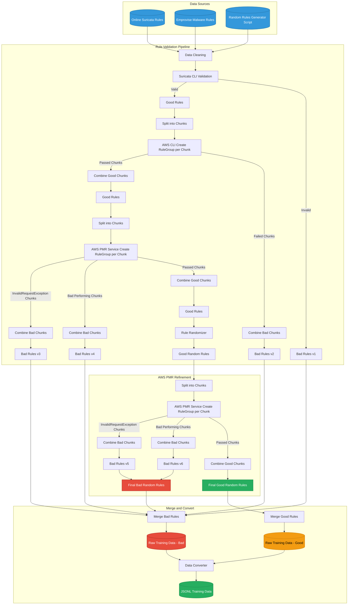

# Suricata Training Rules Generation

```mermaid
flowchart TB
    subgraph Input[Data Sources]
        A[(Online Suricata Rules)]
        T[(Emprovise Malware Rules)]
        RG[(Random Rules Generator Script)]
    end

    subgraph Pipeline[Rule Validation Pipeline]
        B[Data Cleaning]
        C[Suricata CLI Validation]
        C -->|Valid| D[Good Rules]
        C -->|Invalid| E[Bad Rules v1]
        
        D --> F1[Split into Chunks]
        F1 --> F[AWS CLI Create RuleGroup per Chunk]
        F -->|Passed Chunks| F2[Combine Good Chunks]
        F -->|Failed Chunks| F3[Combine Bad Chunks]
        F2 --> G[Good Rules]
        F3 --> H[Bad Rules v2]
        
        G --> I1[Split into Chunks]
        I1 --> I[AWS PMR Service Create RuleGroup per Chunk]
        I -->|InvalidRequestException Chunks| I2[Combine Bad Chunks]
        I -->|Bad Performing Chunks| I3[Combine Bad Chunks]
        I -->|Passed Chunks| I4[Combine Good Chunks]
        I2 --> J[Bad Rules v3]
        I3 --> K[Bad Rules v4]
        I4 --> L[Good Rules]
        
        L --> M[Rule Randomizer]
        M --> N[Good Random Rules]
    end

    subgraph Refinement[AWS PMR Refinement]
        O1[Split into Chunks]
        O1 --> O[AWS PMR Service Create RuleGroup per Chunk]
        O -->|InvalidRequestException Chunks| O2[Combine Bad Chunks]
        O -->|Bad Performing Chunks| O3[Combine Bad Chunks]
        O -->|Passed Chunks| O4[Combine Good Chunks]
        O2 --> P[Bad Rules v5]
        O3 --> R[Bad Rules v6]
        O4 --> Q[Final Good Random Rules]
        P --> S[Final Bad Random Rules]
        R --> S
    end

    subgraph Output[Merge and Convert]
        MG[Merge Good Rules]
        MB[Merge Bad Rules]
        RD[(Raw Training Data - Good)]
        RDB[(Raw Training Data - Bad)]
        DC[Data Converter]
        OUT[(JSONL Training Data)]
        MG --> RD
        MB --> RDB
        RD --> DC
        RDB --> DC
        DC --> OUT
    end

    A --> B
    T --> B
    RG --> B
    B --> C
    N --> O1
    Q --> MG
    E --> MB
    H --> MB
    J --> MB
    K --> MB
    S --> MB

    style A fill:#3498db,stroke:#2980b9,stroke-width:2px,color:#fff
    style T fill:#3498db,stroke:#2980b9,stroke-width:2px,color:#fff
    style RG fill:#3498db,stroke:#2980b9,stroke-width:2px,color:#fff
    style OUT fill:#27ae60,stroke:#229954,stroke-width:2px,color:#fff
    style RD fill:#f39c12,stroke:#d68910,stroke-width:2px,color:#000
    style RDB fill:#e74c3c,stroke:#c0392b,stroke-width:2px,color:#fff
    style S fill:#e74c3c,stroke:#c0392b,stroke-width:2px,color:#fff
    style Q fill:#27ae60,stroke:#229954,stroke-width:2px,color:#fff
```